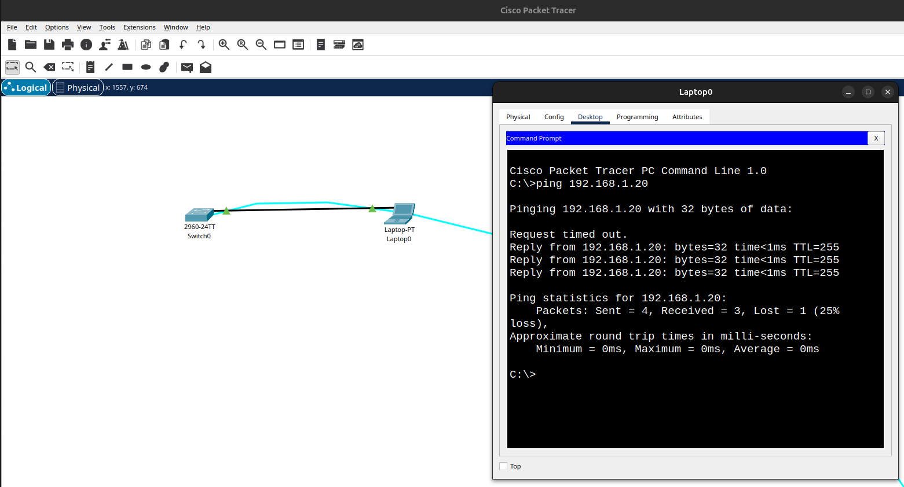
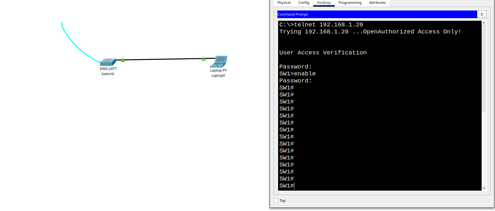
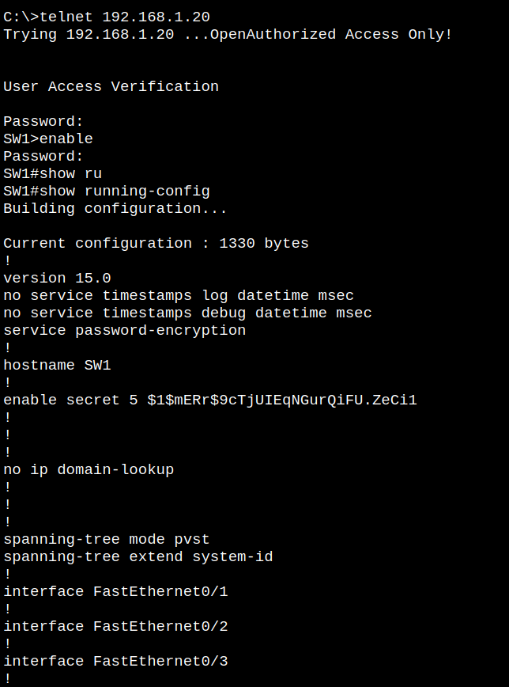
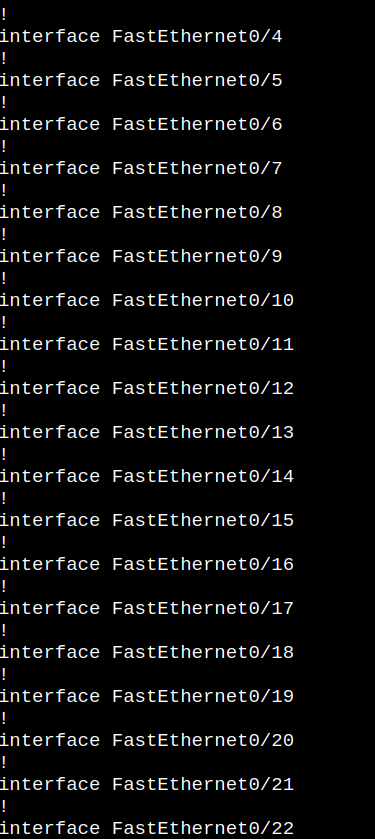
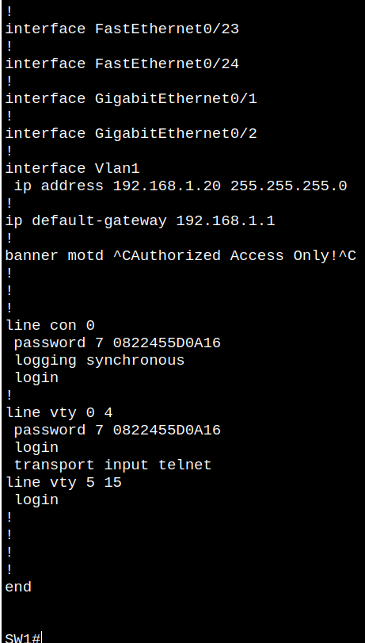

a) ___Почему нужно использовать консольное подключение для первоначальной настройки коммутатора? Почему нельзя подключиться к коммутатору через Telnet или SSH?___  
Потому что у сетевого устройства еще нет ip адреса, не настроен виртуальный терминал, не включены службы на коммутаторе telnet и ssh  

b) ___Изучите текущий файл running configuration___  
___Сколько интерфейсов FastEthernet имеется на коммутаторе 2960?___  
24  
___Сколько интерфейсов Gigabit Ethernet имеется на коммутаторе 2960?___  
2  
___Каков диапазон значений, отображаемых в vty-линиях?___  
line vty 0 4  
line vty 5 15  
Всего 16 виртуальных терминалов  

c) ___Изучите файл загрузочной конфигурации (startup configuration), который содержится в энергонезависимом ОЗУ (NVRAM).___  
___Вопрос:  
Почему появляется это сообщение?___  
Конфигурация не была записана в энергонезависимую ОЗУ появляется сообщение:    
`starup config is not present`                    

d) ___Изучите характеристики SVI для VLAN 1.___  
___Вопрос:  
Назначен ли IP-адрес сети VLAN 1?___  
Нет  
___Какой MAC-адрес имеет SVI? Возможны различные варианты ответов.___  
Таблица мак-адресов пустая: show mac address-table, show arp  
___Данный интерфейс включен?___  
Нет  

e) ___Изучите IP-свойства интерфейса SVI сети VLAN 1.___  
___Вопрос:  
Какие выходные данные вы видите?___  
В конфигурации по дефолту нет этой информации  
`show ip interface vlan 1`    
`Vlan1 is administratively down, line protocol is down`    
`Internet protocol processing disabled`   

f) ___Подсоедините кабель Ethernet компьютера PC-A к порту 6 на коммутаторе и изучите IP-свойства интерфейса SVI сети VLAN 1. Дождитесь согласования параметров скорости и дуплекса между коммутатором и ПК.___  
___Вопрос:  
Какие выходные данные вы видите?___  
`Interface FastEthernet0/6, changed state to up`    
`Line protocol on Interface FastEthernet0/6, changed state to up`  

g) ___Изучите сведения о версии ОС Cisco IOS на коммутаторе.___  
___Вопросы:___    
___Под управлением какой версии ОС Cisco IOS работает коммутатор?___  
`15.0(2)SE4`   
___Как называется файл образа системы?___  
`2960-lanbasek9-mz.150-2.SE4.bin`    

h) ___Изучите свойства по умолчанию интерфейса FastEthernet, который используется компьютером PC-A. Switch# show interface f0/6___   
___Вопрос:  
Интерфейс включен или выключен?___  
Включен - `FastEthernet0/1 is up, line protocol is up (connected)`    
___Что нужно сделать, чтобы включить интерфейс?___  
Команда - `no shutdown`    
___Какой MAC-адрес у интерфейса?___  
`000c.cf6b.5101 (bia 000c.cf6b.5101)`    
___Какие настройки скорости и дуплекса заданы в интерфейсе?___  
`Full-duplex, 100Mb/s`    
mac vlan 1 - `00d0.ff2e.73ed` (команда `show arp`)    
Полоса пропускания интерфейса vlan 1 - `bandwidth 100000 Kbit`    

####Questions:        
___1. Зачем необходимо настраивать пароль VTY для коммутатора?___  
Чтобы ограничить доступ к сетевому устройству в целях безопасности  
___2. Что нужно сделать, чтобы пароли не отправлялись в незашифрованном виде?___  
Использовать протоколы которые шифруют данные, например ssh для подключения к сетевым устройствам или хостам  
___3. Для чего нужна команда login?___  
Команда login активирует механизм аутентификации  

#####Screenshots:    
> Проверка связанности оконечного устройства и сетевого устройства (ping):     
  

> Проверка связанности оконечного устройства и сетевого устройства (telnet):   
  

> Финальная конфигурация сетевого устройства 1:         
  

> Финальная конфигурация сетевого устройства 2:    
       

> Финальная конфигурация сетевого устройства 3:  
      
