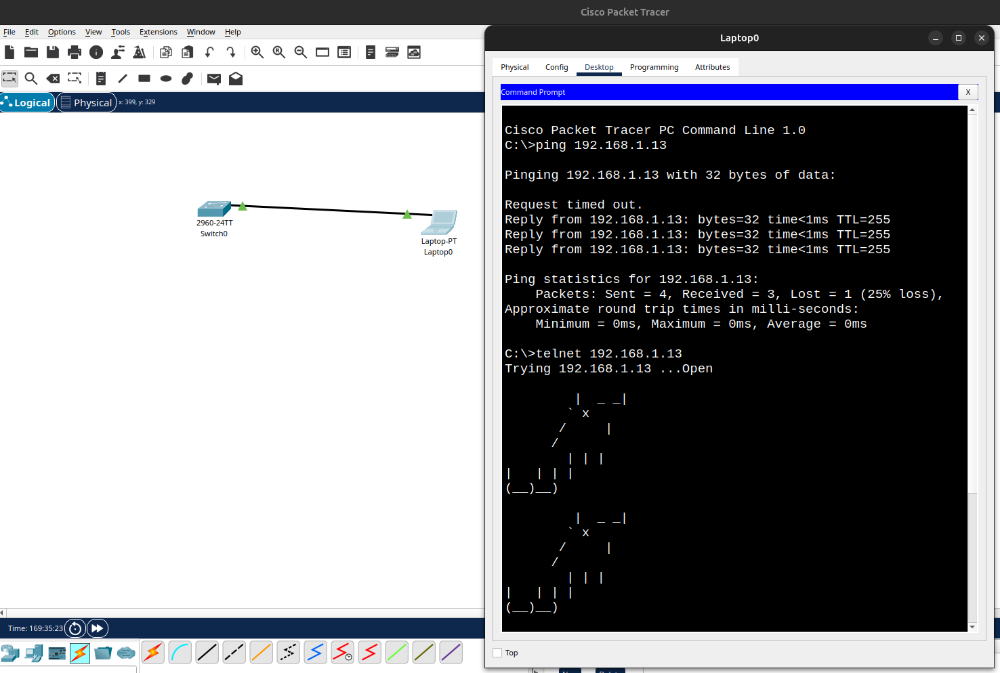
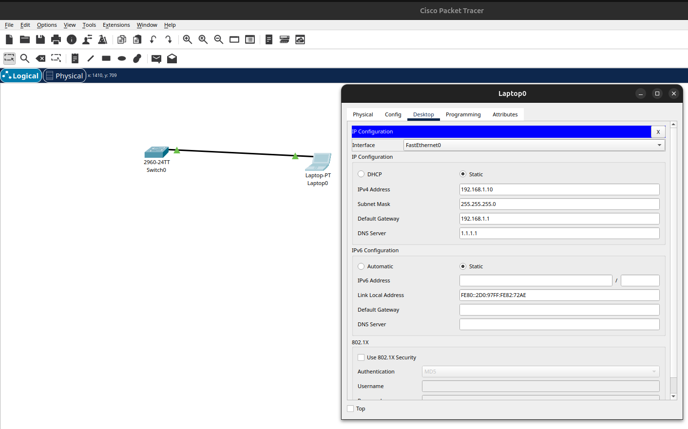

# Лабораторная работа. Базовая настройка коммутатора  

## Топология:  
  

## Таблица адресации:  

    | Device  | Interface | IP-address/prefix         |
    | ------- | --------- | ------------------------- |
    | SW1     | VLAN 1    | 192.168.1.13 ip address   |
    |         |           | 255.255.255.0 mask        |
    |         |           | 192.168.1.1 default route |
    | ------- | --------- | ------------------------- | 
    | PC-A    | NIC       | 192.168.1.10 ip address   |
    |         |           | 255.255.255.0 mask        |
    |         |           | 192.168.1.1 default route |  

## Последовательность настройки коммутатора cisco 2960:  

1. Задать имя сетевого устройства:  
`enable`  
`config terminal`  
`hostname SW1`  

2. Защита устройства и первичная настройка для возможности удаленного доступа:  
`line con 0` (Защита консольного подключения)  
`password cisco`  
`login`    
`end`  

`configure terminal` (Защита рут режима)  
`enable secret class`  
`exit`  

`configure terminal`  
`line vty 0 4` (Добавляем 5 виртуальных терминалов с паролем для удаленного подлючения)  
`password cisco`  
`login`  
`transport input telnet` (Включаем службу telnet на свиче)  
`end`

`configure terminal`  
`service password-encryption` (Шифрование паролей - проверить можно командой show running-config)  
`exit` 

3. Баннер  
`configure terminal`  
`banner motd #`  
	／＞  フ  
         |  _ _|    
        ／` ミ＿xノ    
       /     |    
      /  ヽ   ﾉ    
      │  | | |    
／￣|   | | |    
(￣ヽ＿_ヽ_)__)    
＼二)  
`#`  

4. Настройка виртуальго интерфейса коммутарора:  
`configure terminal`  
`interface vlan 1`  
`ip address 192.168.1.13 255.255.255.0`    
`ip default-gateway 192.168.1.1`    
`no shutdown`  

5. Общие настройки для удобства работы:  
`configure terminal`  
`no ip domain-lookup` (Маршрутизатор или коммутатор перестает отправлять запросы на разрешение имен в DNS-серверы)  
`line con 0`  
`logging synchronous` (Чтобы консольные сообщения не прерывали выполнение команд)   

6. Сохранение текущей конфигурации в энергонезависимую память nvram в рут режиме:  
`enable`  
`copy running-config startup-config`  

7. Удаление конфигурации сетевого устройства:  
`enable`  
`erase startup-config`  
`reload`  

## Ответы на вопросы из методички:

___a) Почему нужно использовать консольное подключение для первоначальной настройки коммутатора? Почему нельзя подключиться к коммутатору через Telnet или SSH?___  

- **Потому что у сетевого устройства еще нет ip адреса, не настроен виртуальный терминал, не включены службы на коммутаторе telnet и ssh**  

___b) Изучите текущий файл running configuration___  
___Сколько интерфейсов FastEthernet имеется на коммутаторе 2960?___  

- **24**

___Сколько интерфейсов Gigabit Ethernet имеется на коммутаторе 2960?___  

- **2** 

___Каков диапазон значений, отображаемых в vty-линиях?___  

- `line vty 0 4`    
`line vty 5 15`    
**Всего 16 виртуальных терминалов**    

___c) Изучите файл загрузочной конфигурации (startup configuration), который содержится в энергонезависимом ОЗУ (NVRAM).___  
___Вопрос:  
Почему появляется это сообщение?___  

- **Конфигурация не была записана в энергонезависимую ОЗУ появляется сообщение:**      
`starup config is not present`                    

___d) Изучите характеристики SVI для VLAN 1.___  
___Вопрос:  
Назначен ли IP-адрес сети VLAN 1?___  

- **Нет**      

___Какой MAC-адрес имеет SVI? Возможны различные варианты ответов.___  

- **Таблица мак-адресов пустая: `show mac address-table`, `show arp`**      

___Данный интерфейс включен?___  

- **Нет**    

___e) Изучите IP-свойства интерфейса SVI сети VLAN 1.___  
___Вопрос:  
Какие выходные данные вы видите?___  

- **В конфигурации по дефолту нет этой информации**    
`show ip interface vlan 1`    
`Vlan1 is administratively down, line protocol is down`    
`Internet protocol processing disabled`   

___f) Подсоедините кабель Ethernet компьютера PC-A к порту 6 на коммутаторе и изучите IP-свойства интерфейса SVI сети VLAN 1. Дождитесь согласования параметров скорости и дуплекса между коммутатором и ПК.___  
___Вопрос:  
Какие выходные данные вы видите?___  

- `Interface FastEthernet0/6, changed state to up`    
`Line protocol on Interface FastEthernet0/6, changed state to up`  

___g) Изучите сведения о версии ОС Cisco IOS на коммутаторе.___  
___Вопросы:___    
___Под управлением какой версии ОС Cisco IOS работает коммутатор?___  

- `15.0(2)SE4`   

___Как называется файл образа системы?___  

- `2960-lanbasek9-mz.150-2.SE4.bin`    

___h) Изучите свойства по умолчанию интерфейса FastEthernet, который используется компьютером PC-A. Switch# show interface f0/6___   
___Вопрос:  
Интерфейс включен или выключен?___  

- Включен - `FastEthernet0/1 is up, line protocol is up (connected)`    

___Что нужно сделать, чтобы включить интерфейс?___  

- Команда - `no shutdown`    

___Какой MAC-адрес у интерфейса?___  

- `000c.cf6b.5101 (bia 000c.cf6b.5101)`    

___Какие настройки скорости и дуплекса заданы в интерфейсе?___  

- `Full-duplex, 100Mb/s`    
mac vlan 1 - `00d0.ff2e.73ed` (команда `show arp`)    
Полоса пропускания интерфейса vlan 1 - `bandwidth 100000 Kbit`    

## Вопросы для повторения:          
___1. Зачем необходимо настраивать пароль VTY для коммутатора?___  

- **Чтобы ограничить доступ к сетевому устройству в целях безопасности**    

___2. Что нужно сделать, чтобы пароли не отправлялись в незашифрованном виде?___

- **Использовать протоколы которые шифруют данные, например ssh для подключения к сетевым устройствам или хостам**   

___3. Для чего нужна команда login?___  

- **Команда login активирует механизм аутентификации**    

## Скриншоты:      
> Проверка связанности оконечного устройства и сетевого устройства (ping):     
  

> Проверка связанности оконечного устройства и сетевого устройства (telnet):   

> Эхо запрос и подключение по telnet:  
  

> Мануальная конфигурация хоста:  
    

> Финальная конфигурация сетевого устройства 1:         
  

> Финальная конфигурация сетевого устройства 2:    
       

> Финальная конфигурация сетевого устройства 3:  
      
